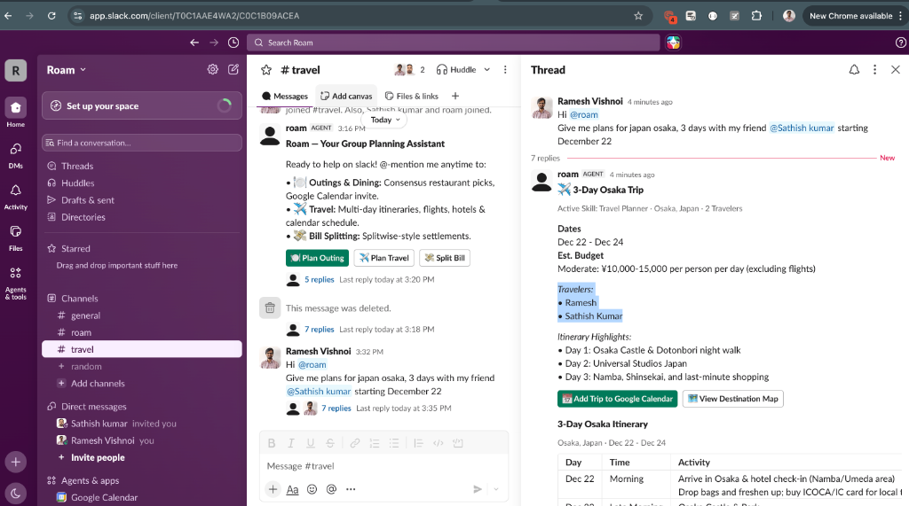
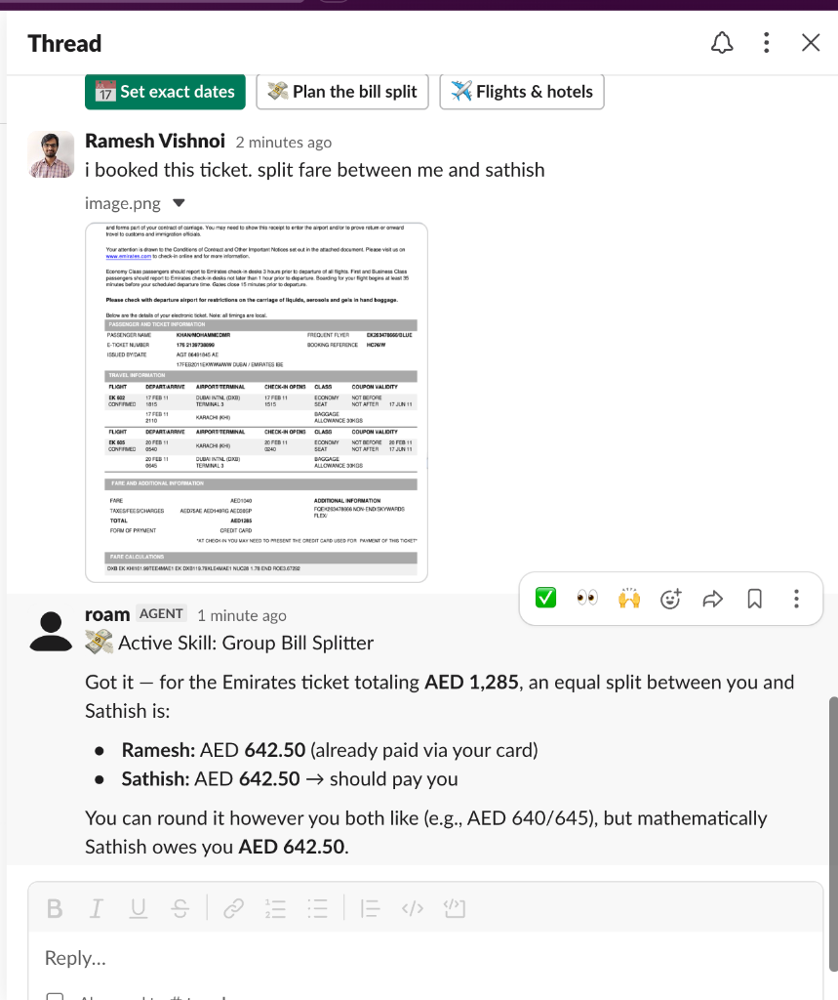

# Project Roam: Multiplayer Outing & Dining Concierge Agent

> **Built for:** AI Tinkerers Global Hackathon — *Agents, Everywhere*  
> **Primary Surface:** Slack Channels & Threads (`@copilotkit/channels`)  
> **Companions:** Group Canvas Web App (`apps/web`) & Mobile Expense Tracker (`apps/mobile`)

---

## 1. Project Overview & Problem Solved

Planning group outings, offsites, and dinners in team channels is notoriously chaotic:
- Group chats devolve into dozens of fragmented messages and competing schedules.
- Conflicting dietary requirements (e.g., vegan, halal, gluten-free, nut allergies) and disparate budgets create decision paralysis.
- Organizers struggle to finalize meeting spots, confirm bookings, generate calendar invites, and settle expenses fairly.

A traditional standalone chatbot fails in this setting because it is trapped in a private 1:1 conversation. It forces a single organizer to act as an exhausted "human router"—copying preferences into a private bot and copy-pasting suggestions back to the team.

**Roam lives directly inside the Slack thread where the group is already talking.** Acting like a teammate in the room, Roam listens to everyone's stated preferences, reads ambient thread history (`read_thread`), and performs **Multiplayer Group Context Arbitration**—synthesizing a consensus plan that balances everyone's constraints simultaneously.

---

## 2. Core Capabilities & Workflows

### 🍽️ Group Dinner & Outing Coordination
Roam analyzes the active thread to extract each participant's constraints:
- **Dietary:** Vegan, vegetarian, halal, gluten-free, allergy restrictions.
- **Budget:** Price tiers (`$`, `$$`, `$$$`), target budget per person.
- **Atmosphere & Location:** Preferred neighborhoods, outdoor seating, noise level.
It arbitrates conflicting constraints to suggest verified, real-world venues.

### 🖼️ Multimodal Vision Venue Discovery
Members can drop screenshots of menus, event flyers, or landmark photos directly into the conversation. Roam's multimodal vision engine parses:
- Restaurant/venue name and category.
- Menu items, price points, and dietary/allergen tags.
- Group fit breakdown explaining why the spot works for the group's specific constraints.

### 📍 Finalizing Meeting Points & Maps Integration
Roam computes optimal, central meeting locations and provides verified **Google Maps** deep links for turn-by-turn navigation.

### 📅 1-Click Google Calendar Invites
Once consensus is reached, Roam calls `create_calendar_event` to generate a 1-click Google Calendar invite pre-filled with:
- Outing title and venue name.
- Address and neighborhood location.
- Date, start time, and duration.
- Tagged attendee list and dietary notes.

### 💳 Expense Settlement & Multimodal Bill Splitting
Roam coordinates expense settlement and budget tracking. Proposed reservations, itinerary bookings, or financial splits are posted as native approval cards. Users can upload images of tickets, receipts, or invoices, and Roam's vision engine extracts line items, totals, and currency (e.g. AED) to generate exact, mathematically fair settlements between members.

### ✈️ Multi-Day Itinerary & Group Travel Planning
Roam designs end-to-end trip plans when destinations, dates, and budgets are mentioned in the channel:
- Tracks the full traveler roster across all channel members (e.g. Ramesh & Sathish).
- Recommends day-by-day itineraries, flight & hotel options, and local transit tips.
- Provides 1-click Google Calendar integration (`create_calendar_event`) and interactive day filtering.

### 🎴 Native Interactive Block Kit Cards
Instead of walls of plain text, Roam renders native interactive Slack cards:
- **`GroupConsensusCard`:** Highlights the chosen venue, constraint badges, match score, and a point-by-point breakdown of **"Why It Works For Everyone"** addressing each person by name.
- **`ItineraryCard`:** Renders structured multi-stop schedules with times, activities, and locations.
- **`TravelPlanCard`:** Renders destination headers, dates, per-person budget tiers, traveler rosters, and highlights.
- **`BillSplitCard`:** Displays total amounts, currency, payer breakdown, and exact settlement shares.
- **Interactive Action Buttons:** 📍 *Open in Maps*, 📅 *Add to Google Calendar*, ✈️ *Flights & Hotels*, 💸 *Plan Bill Split*, and *Vote / Confirm*.

---

## 3. 📸 Live Demo Screenshots & Real Interactions

### 1. ✈️ 3-Day Osaka Trip Planning & Native Itinerary in Slack
Mentioning `@roam` in `#travel` with destination and group constraints immediately generates a customized multi-day travel card with group members, budget estimations, and an interactive itinerary table with one-click Google Calendar scheduling:

### 2. 💸 Multimodal Ticket & Receipt Bill Splitting via Vision
Uploading an e-ticket, invoice, or receipt image in Slack triggers vision inspection. Roam extracts line items, totals, and currency (e.g., Emirates flight ticket totaling AED 1,285), computing fair per-person splits and settlement instructions directly in thread:

---

## 4. Technical Execution & Stack

| Layer | Technologies & Frameworks | Role in Roam |
|---|---|---|
| **Agent Plumbing** | `@copilotkit/channels`, `@copilotkit/runtime` | Manages Slack channel subscriptions, ambient thread context, streaming responses, and Block Kit rendering. |
| **Agent Protocol** | `@ag-ui/client`, `@ag-ui/core`, RxJS | Isomorphic event stream handling, state persistence, and re-entrant execution. |
| **Reasoning Engine** | OpenAI (`gpt-4o` / `gpt-5.1`) | Conversational arbitration, conflict resolution, constraint extraction, and consensus synthesis. |
| **Multimodal Vision** | OpenAI Vision API | Analyzes uploaded images (menus, event posters, venue photos, flight tickets, receipts) to extract structured JSON data. |
| **Validation** | Zod | Strictly validates schemas for constraints, consensus cards, itineraries, and calendar events. |
| **Real-Time Discovery** | Exa AI Search API | Live web grounding and real-time venue verification. |
| **Calendaring & Maps** | Google Calendar RFC 5545, Google Maps API | 1-click calendar invite links and location deep-links. |
| **Multi-Surface Web/Mobile** | Next.js (App Router), React Native / Expo | Interactive Group Canvas web companion and mobile expense tracking. |

---

## 5. Why Roam Delivers Meaningful Value

1. **Ambient Awareness:** Sits in the room where decisions are already happening—no app switching or manual re-entry.
2. **Transparent Arbitration:** Shows members *why* a venue was selected for them individually, fostering trust and rapid buy-in.
3. **Actionable UI Over Chat Walls:** One glanceable card with maps, calendar links, and confirmation buttons replaces dozens of back-and-forth messages.
4. **End-to-End Journey:** Takes a group seamlessly from *"Where should we eat?"* through image analysis, scheduling, and expense settlement.
